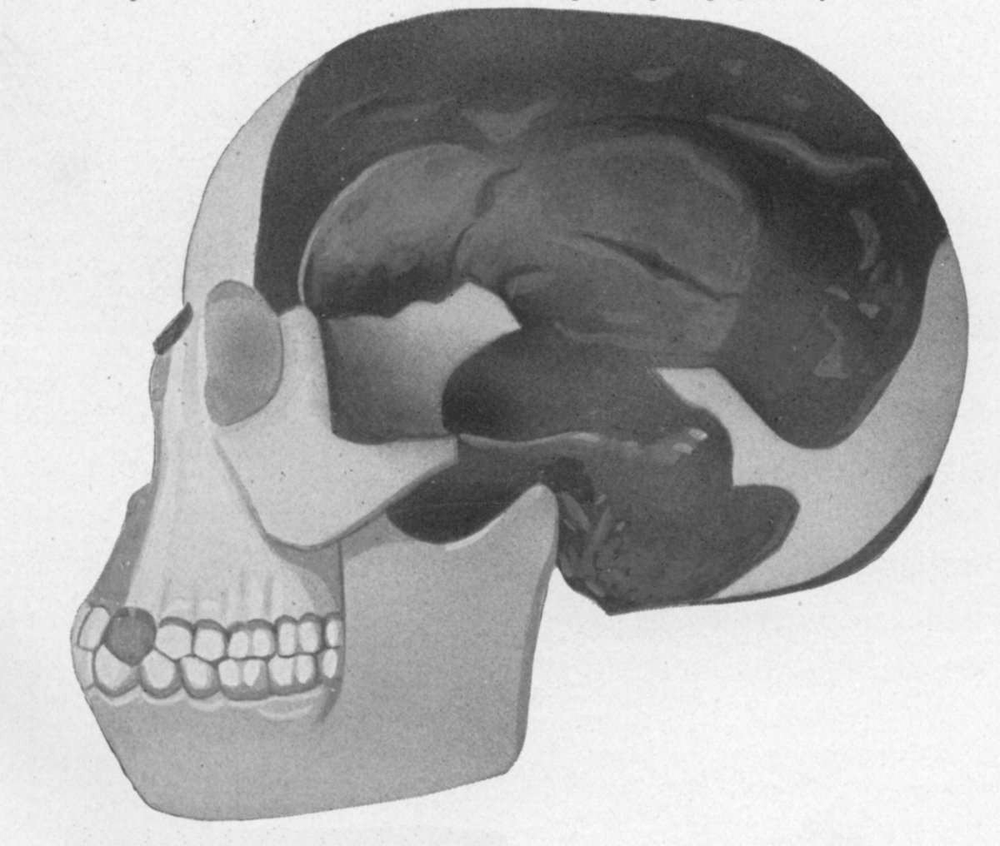

# Piltdown
[](https://shields.io/)


*"Data visualiation for your tweets... making your mindless propaganda look more scientific since 2021!"*

**YE OLDE TABLE OF CONTENTS**

- [Introduction](#introduction) *Wherein is answered the question of what it is and what it's for*
    - [Caveats](#caveats)
    - [The Basic Idea](#the-basic-idea)
- [Installation](#installation) *Wherein is answered the question of how to get it*
- [Documentation by Example](#documentation-by-example) *Wherein is answered the question of how to make it go go go!*
    - [Plots](#ye-olde-plots)
        - [Column Sparklines](#column-sparklines)
        - [Comparison Charts](#comparison-charts)
        - [Dot Charts](#dot-charts)
        - [Horizontal Bar Charts](#horizontal-bar-charts)
        - [Horizontal Dot Charts](#horizontal-dot-charts)
        - [Scaled-Up Numbers](#scaled-up-numbers)
        - [Tables](#tables)
        - [Tally Charts](#tally-charts)
        - [Waffle Charts](#waffle-charts)
        - [Win/Loss Sparklines](#win-loss-sparklines)
    - [Utilities](#utilities)
        - [bold()](#bold) -- Bold output using Unicode mathematical bold
        - [cut_above()](#cut_above) -- Add a "cut above this line" line to the output
        - [cut_below()](#cut_below) -- Add a "cut below this line" line to the output
        - [fullwidth()](#fullwidth) -- Write text in Unicode fullwidth (alternate monospace)
        - [monospace()](#monospace) -- Write text in Unicode fake monospace
        - [with_char_count()](#with_char_count) -- Return failure message if a string is > 280 characters long
        - [with_cut_lines()](#with_cut_lines) -- Wrap output in cut_below() and cut_above()
- [Hacking](#hacking) *Wherein is -- oh, this is getting boring*
    - [Project Goals](#project-goals)
    - [Todo](#todo)
- [Credits](#credits)
- [Final words](#final-words)

## Introduction

*or, What is it? and what's it for?*

**Piltdown is a tiny, nay, even trivial Python library
that generates Unicode strings of bar charts
and some other data visualization thingies
which are meant to be included in your Twitter posts.**

See the Documentation section below for examples.

What kind of charts, you ask? Also see the Documentation section for examples.

But see all the --


### Caveats

I mean, they're pretty obvious.

1. There is only so much you can do with nothing but text that is always left-justified, displayed in a very narrow column, and in a variable-width font--even with Unicode. If you think you can pull off a scatter plot with variable width Unicode in the space of a tweet, by all means, send me a PR.

2. Screen readers. I don't know how many times I mention it below, but Unicode hacks are inherently unfriendly to the blind. Beware.

3. You will see weird font compatibility issues. Github won't even render everything right every time in this README on Qutebrowser under Linux for me. Sometimes the column sparkline glyphs are weirdly off-center, sometimes the tally marks are missing.... Who knows? Some platform/font combinations render this stuff correctly, some don't. That's just all there is to it.

I wrote this for the fun of it,
on a lark. Don't get all testy with me.

### The Basic Idea

For most of the types of plot, you will specify your data set,
(typically a list, list of tuples, dict, etc.).
Generating this from a dataframe or other form is your problem--Piltdown just generates strings. That's all.
There are a million utilities that could be included
to post your string to Twitter for you,
or to do other Unicode tricks,
like bold or italics,
but at least for the moment
Piltdown wants to do one thing and do it (tollerably) well:
generate strings that work as data viz in the space of a tweet.
That means generally just the graphic elements and sometimes axis labels.
Titles and keys are mostly your problem.
But the idea is that all you have to do is concatenate any string you want
with the output of your Piltdown graph,
and thus becometh Robert your parent's brother.


## Installation

Clone the repository, `cd` to your new `piltdown` directory, and then do --

    pip install .
    
or the local equivalent (eg. `pip3 install .` )

Or at some point maybe I will make it installable from PyPi or whatever it's called.

Or you can just, like, load up the files any old way you want. It's pretty simple.

Anyway, if you do the pip thing, then import things as you need them as per the examples in, you guessed it, the Documentation section below.


## Documentation by Example

### Ye Olde Plots
In alphabetical order:

#### Column Sparklines

The Twitter plot that started it all! Lavishly praised by none other than the great Edward Tufte as "...[better than nothing](https://www.edwardtufte.com/bboard/q-and-a-fetch-msg?msg_id=0003oC)..."!

At any rate, I noticed them and that inspired the rest of this.

##### Example

Note that there are only 8 levels available, and all your numbers will be scaled based on your highest value. This isn't high-precision stuff here.


```python
import piltdown.column_sparkline as cspar

# Data channeled by me from the spirit of an ancient cat.
print("Daily how much I like Twitter the last 10 days: " +
     cspar.column_sparkline([2,4,8,10,0,3,4,5,1,4]) +
     " on a scale of 1 to 10...\nso don't get your hopes up about another post.")
```

    Daily how much I like Twitter the last 10 days: ▂▄▇█　▃▄▄▁▄ on a scale of 1 to 10...
    so don't get your hopes up about another post.


#### Comparison Charts
Comparison charts are, at least minimally, just tables with checkmarks and X's in the cells. See [Tables](#tables). There is no Unicode fullwidth checkmark, so you need to use something else that is basically something in the ASCII subset that is represented by the Unicode fullwidth set. X's and O's or T's (for True) and F's (for False) are probably the best bets.

The same caveat applies. Column and row headers are best kept very short.

##### Example


```python
import piltdown.table as tbl
import piltdown.literals as lit

# Data based on, well duh, obviously.
print("\n" +
    tbl.table([["",         "Com", "Ver", "Awe"],
               ["Mplib",    "T",   "T",   "F"],
               ["Ggplot2",  "T",   "T",   "F"],
               ["Piltdown", "F",   "F",   "T"]]
              ) +
                "\nMplib = Matplotlib\n" +
                "Com = Comprehensive; Ver = Well-verified; Awe = Awesome"
)
```

    
    　　　　　　　　　Ｃｏｍ　Ｖｅｒ　Ａｗｅ
    Ｍｐｌｉｂ　　　　Ｔ　　　Ｔ　　　Ｆ　　
    Ｇｇｐｌｏｔ２　　Ｔ　　　Ｔ　　　Ｆ　　
    Ｐｉｌｔｄｏｗｎ　Ｆ　　　Ｆ　　　Ｔ　　
    
    Mplib = Matplotlib
    Com = Comprehensive; Ver = Well-verified; Awe = Awesome


#### Dot Charts

##### Example

Note that the number of characters used is Width x max height, because it has to be padded with whitespace characters. The one below, for example, is 10 high, plus one more for the label, which means 11 times 7 = 77 characters.


```python
import piltdown.dot_chart as dc

# Data seems about right.
print("Number of Episodes of Animaniacs My Son Watched This Week\n" +
      dc.dot_chart([3, 2, 5, 0, 9, 4, 7],
                  ["M", "T", "W", "R", "F", "S", "U"]))
```

    Number of Episodes of Animaniacs My Son Watched This Week
    
    　　　　＊　　
    　　　　＊　　
    　　　　＊　＊
    　　　　＊　＊
    　　＊　＊　＊
    　　＊　＊＊＊
    ＊　＊　＊＊＊
    ＊＊＊　＊＊＊
    ＊＊＊　＊＊＊
    ＭＴＷＲＦＳＵ
    


##### Example

You can also use literals.DEFAULT_LABELS for labels and then include a key --


```python
import piltdown.dot_chart as dc
import piltdown.literals as lit

# Now I'm just being mean...
print("Who Knocked On My Door Today?" +
      dc.dot_chart([3, 4, 1],
      lit.DEFAULT_LABELS) +
      "\nA = Jehovah's Witnesses; B = Mormons; C = Avon Lady"
     )
```

    Who Knocked On My Door Today?
    　＊　
    ＊＊　
    ＊＊　
    ＊＊＊
    ＡＢＣ
    
    A = Jehovah's Witnesses; B = Mormons; C = Avon Lady


#### Horizontal Bar Charts

##### Example


```python
import piltdown.hbar_chart as hbar
import piltdown.util as util
import piltdown.literals as lit

# Source: https://i.imgur.com/CswBFYU.jpg
print(util.bold("Which should cost less: a\ngallon of gas or a gallon of milk?\n\n") +
                hbar.hbar([43, 57], ["YES % ", "NO % "]))
```

    𝐖𝐡𝐢𝐜𝐡 𝐬𝐡𝐨𝐮𝐥𝐝 𝐜𝐨𝐬𝐭 𝐥𝐞𝐬𝐬: 𝐚
    𝐠𝐚𝐥𝐥𝐨𝐧 𝐨𝐟 𝐠𝐚𝐬 𝐨𝐫 𝐚 𝐠𝐚𝐥𝐥𝐨𝐧 𝐨𝐟 𝐦𝐢𝐥𝐤?
    
    ＹＥＳ　％　█████████43
    　ＮＯ　％　████████████57
    


#### Horizontal Dot Charts

Not to be confused with a dot plot.
This is the kind of thing they use on Khan Acadamy
to teach small children about data.
This is the horizontal version.

##### Example

Note Labels are automatically converted to the Unicode manthimatical "fullwidth" characters, which do not play nicely with screen readers. Beware the righteous wrath of the screen reader user.


```python
import piltdown.hdot_chart as hdot

# Data completely made up and implausible.
print(
    "How many times I ate chocolate this week:\n\n"
    + hdot.hdot_chart(
        [3, 2, 4, 0, 2, 1, 4],
        ["Mo", "Tu", "We", "Th", "Fr", "Sa", "Su"]
    )
)
```

    How many times I ate chocolate this week:
    
    Ｍｏ|⚫⚫⚫
    Ｔｕ|⚫⚫
    Ｗｅ|⚫⚫⚫⚫
    Ｔｈ|
    Ｆｒ|⚫⚫
    Ｓａ|⚫
    Ｓｕ|⚫⚫⚫⚫


#### Scaled Up Numbers

High tech.

##### Example

Se literals.py for the font definitions. By all means, send me a PR with a better version, or additional fonts.

Would like to support all digits, the comma (,) the period (.) and the percent (%) sign at the least.

Use `leading_pad` to adjust left-padding to center your number if you want, but remember that will take up `leading_pad` times number of lines in the font of your alloted 280 tweet characters. So in the case below, the pad alone takes up 50 characters, and the total for the number below is therefore 85 (the default font is 3x5 chars plus an extra column blank between each number). The default padding is 4.


```python
import piltdown.scaled_up_number as sun

# Can I get my nerd card punched now?
print(sun.scaled_up_number("42", leading_pad=10) +
     "\nMeaning of life, the Universe, and everything.")
```

    　　　　　　　　　　░░▟　▄▆▖
    　　　　　　　　　　░▞█　▘░▛
    　　　　　　　　　　▟▄█　░▞░
    　　　　　　　　　　░░█　▐░░
    　　　　　　　　　　░░█　█▄▟
    
    Meaning of life, the Universe, and everything.


##### Example

With this one, the number takes up 155 characters.

**NOTE** however, that on a cell phone I don't think you can count on lines of more than about 20 characters, so this would actually try to wrap, I believe. Maybe I should try it on Twitter and see.


```python
import piltdown.scaled_up_number as sun

# Sorry.
print(sun.scaled_up_number("1,235.7%", leading_pad=0) +
     "\nYour Mom's age compared to mine, as a very precise percentage.")
```

    　░█░　░░░　▄▆▖　▟▀▙　▛▀▜　░░░　▛▀█　█░▞
    　▞█░　░░░　▘░▛　░░█　▌░░　░░░　░░▛　░▐░
    　░█░　░░░　░▞░　░█░　█▀▙　░░░　░▞░　░▞░
    　░█░　░░░　▐░░　░░█　░░▐　░░░　▐░░　░▌░
    　▗█▖　░▜░　█▄▟　▜▄▛　█▄▛　░▖░　█░░　▞░█
    
    Your Mom's age compared to mine, as a very precise percentage.


#### Tables

Very small tables can be done using the util.to_monospace trick. Little two-way contingency tables might be done, for example.

##### Example

Note that you can use strings or floats/ints and they will converted to strings automatically.

Also note that an empty string will be interpreted as an empty cell.

At the moment that's all there is. No fancy cell/row/column borders or anything else.


```python
import piltdown.table as tbl

# Data imaginatively cribed from the Wikipedia entry for "Contingency Table."
print("Handedness (L or R) vs. Sex (M or F) Contingency Table\n" +
    tbl.table([["",   "R", "L", "Tot"],
               ["M",   43,  9,   52],
               ["F",   44,  4,   48],
               ["Tot", 87,  13,  100]]
              )
)
```

    Handedness (L or R) vs. Sex (M or F) Contingency Table
    　　　　Ｒ　　Ｌ　　Ｔｏｔ
    Ｍ　　　４３　９　　５２　
    Ｆ　　　４４　４　　４８　
    Ｔｏｔ　８７　１３　１００
    


#### Tally Charts

Another one they use to teach "data literacy" to kids, mostly, I think.

##### Example

Not super pretty, as the tally characters have slightly slanted lines. There might be a better way to do the onesie-twosie characters. Also, they don't seem to work in whatever font Github uses for this README.

Note that you want your labels to be all the same length. If that's not conventient, I recommend using A, B, C, etc. or something similar, and then including a key below your chart.


```python
import piltdown.tally as tally

# Data completely made up. What kind of gluttons do you think we are?
print("How Many Chocolate Bars My Family Ate This Week\n\n" +
     tally.tally({"Mo": 5, "Tu": 11, "We": 3, "Th": 0, "Fr": 18, "Sa": 26, "Su": 17})
     )
```

    How Many Chocolate Bars My Family Ate This Week
    
    Ｍｏ￤ᚎ　
    Ｔｕ￤ᚎ　ᚎ　𝍩
    Ｗｅ￤𝍫
    Ｔｈ￤
    Ｆｒ￤ᚎ　ᚎ　ᚎ　𝍫
    Ｓａ￤ᚎ　ᚎ　ᚎ　ᚎ　ᚎ　𝍩
    Ｓｕ￤ᚎ　ᚎ　ᚎ　𝍪
    


#### Win Loss Sparklines

Tastes as good as it sounds!

##### Example

Note that you are basically just plotting signum of whatever numbers you give. 

Also note that a zero plots as a thin line through the middle.


```python
import piltdown.win_loss_sparkline as wl

# Actual data from my Garmin watch doodad.
print("My sleep time for the last 7 days, greater than or less than 8 hours: " +
     wl.win_loss_sparkline([2.3, -3, -0.1, 2, 0, 67]) +
     " rounded to nearest half hour." 
     )
```

    My sleep time for the last 7 days, greater than or less than 8 hours: ▀▄▄▀－▀ rounded to nearest half hour.


#### Waffle Charts

Just at the moment you can select your own glyphs (or use the defaults, `literals.WAFFLES`) and that's about it. 

**Note** that I think these glyphs are being counted as two characters each, so that means a 10x10 waffle would cound as 210 characters on your limit (including the 10 newline characters). So... be knowing of that.

**Alzo note** The moiré effect of these glyphs is obviously pretty terrible. If you can find a better set for the defaults, please let me know.

Waffles fill from top to bottom, first left-to-right, then right-to-left in alternating lines. I intend to write something that will let you fill from top to bottom, but writing the routine that rotates ragged two-dimensional lists is, you know, a job for a real programmer.

Also, at the moment some glyphs aren't the same size as others in some fonts, so a little testing on Twitter might be called for.

##### Example


```python
import piltdown.waffle as wfl

# Completely real data.
print("Pets Owned by Aliens by %\n" + 
      wfl.waffle([16, 66, 18], ["Babel Fish", "Tribble", "Wookie"])
     )
```

    Pets Owned by Aliens by %
    ▩▩▩▩▩▩▩▩▩▩
    ▩▩▩▩▩▩▥▥▥▥
    ▥▥▥▥▥▥▥▥▥▥
    ▥▥▥▥▥▥▥▥▥▥
    ▥▥▥▥▥▥▥▥▥▥
    ▥▥▥▥▥▥▥▥▥▥
    ▥▥▥▥▥▥▥▥▥▥
    ▥▥▥▥▥▥▥▥▥▥
    ▦▦▦▦▦▦▦▦▥▥
    ▦▦▦▦▦▦▦▦▦▦
    
    ▩ = Babel Fish; ▥ = Tribble; ▦ = Wookie
    


### Utilities

Various little helpers which you may variously find helpful.

#### bold()

Fake bold using the Unicode mathematical bold characters for Latin and Greek capitals and miniscules, and Arabic digits. Yet again I warn you: screen readers might not like this.

You can include any other character you like (eg., punctuation characters) but they will simply be passed to the return string unchanged.

##### Example


```python
import piltdown.util as util

print("This is a " + util.bold('very "important" thing to say!'))
```

    This is a 𝐯𝐞𝐫𝐲 "𝐢𝐦𝐩𝐨𝐫𝐭𝐚𝐧𝐭" 𝐭𝐡𝐢𝐧𝐠 𝐭𝐨 𝐬𝐚𝐲!


#### fullwidth

Convert text to fake monospace using the Unicode "fullwidth" character set. Yet again I mention that this does not play well with screen readers. With this you have access to punctuation characters (unlike the monospace() function) but the tradeoff is that they are very wide, and it doesn't take many to go as wide as works on a Twitter on a cell phone.

##### Example


```python
import piltdown.util as util

print(util.fullwidth("Witty example text."))
```

    Ｗｉｔｔｙ　ｅｘａｍｐｌｅ　ｔｅｘｔ．


#### monospace

Fake monospace with Unicode mathimatical monospace. The only characters, though, are Latin capitals and miniscules and Arabic digits. **NOTE No punctuation! and no SPACE character!** So, if you need those things, try `fullwidth()` which has them, but which is very wide, and for which therefore fewer characters fit in a tweet on a narrow cell phone screen.

##### Example


```python
import piltdown.util as util

print(util.monospace("Foobar"))
```

    𝙵𝚘𝚘𝚋𝚊𝚛


#### with_char_count

Use to wrap output. It will return a failure message if your string is longer than 280 characters.

**OBVIOUS NOTE** If you're going to use `with_cut_lines` or similar with this, put the call to that *outside* of the call to `with_char_count`, or else you'll end up counting the cut lines.

##### Example


```python
import piltdown.util as util

print(util.with_char_count("This is short enough to be a tweet!"))

print(util.with_char_count("x" * 281))
```

    This is short enough to be a tweet!
    String too long to post on Twitter


## Hacking

#### Project goals

(Other than the lulz)

- Simple
- *Really simple*
- Simple enough to just write static documentation-by-examples here in the README
- Simple enough that the examples in the documentation here can serve as a rudimentary test suite
- (Mostly) don't try to do anything but create the charts and graphs.
  Just functions that return strings.
  Leave Twitter posting, statistical preprocessing,
  and mixing output with other strings (titles, general writing, etc.)
  to the user/other libraries.
- Easy to use.
- Portable with no dependencies other than basic Python 3
- Just focused on the Twitter use case.
  Not a general solution to the *Grand ASCII-art Data Viz Problem*,
  which is never-ending.
  
#### And also

The README is generated from this Jupyter notebook. Don't forget to re-export it to README.md if you make changes.

#### TODO

- Maybe an italic font as well, though that seems less useful. Also maybe some variables bound to generally useful Unicode characters (smileys, Harvey balls, etc)
- Tweet threads? Could it be done? *Should* it be done? Well, yes and no, of course...
- Instead of telling people to have labels all the same length (eg. horizontal dot chart) just pad to max(len(...))
- Better examples. Better... or at least funnier.

A list of plots I got somewhere that looked at a quick glance like they might be possible. Not to be interpreted as firm intentions. More or less in descending order of priority.

- bullet diagram
- stem and leaf 
- heatmap
- boxplot
- stacked bar
- grouped barchart
- lollypop chart
- pictorial unit -- basically allow custom characters for the dot chart, one per line

Maybe look at later.
- treemap
- funnel
- linear process diagram
- nested/layered proportional area 
- pyramid diagram
- dumbell plot
- partition layer chart icicle diag
- stepped line graph
- kagi chart
- dot matix


## Credits

In the immortal words of Olin Shivers: I did it. I did it all, by myself.

## Final words

This yak... is shaved.
